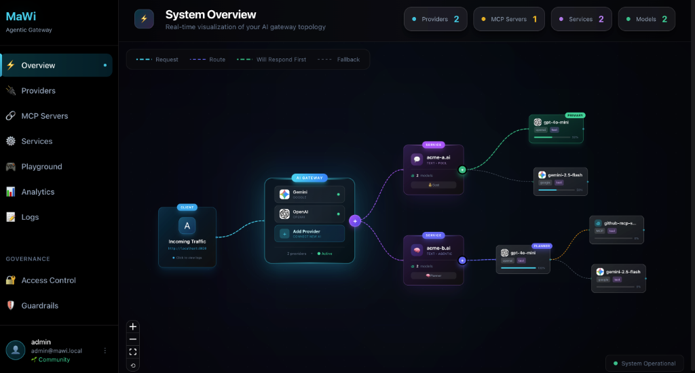
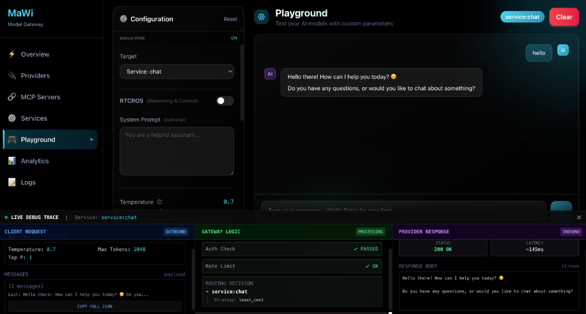

# MaWi Gateway

**Open source AI Agentic Gateway** - Unified API interface that provides access to multiple AI Models and MCPs (OpenAI, Azure, Gemini, Anthropic, etc.). It intelligently routes requests, manages quota, handles authentication, and provides a consistent interface for multimodal AI capabilities including chat, image generation, video generation, and audio processing.

[](LICENSE)
[](docker-compose.yml)



## 🌟 Always Open Source

MaWi Gateway core will **always be free and open source**. Team and Enterprise editions will add exclusive features like multi-user collaboration and SSO, but the core functionality remains free forever.

## ✨ Features (Community Edition)

- 🔌 **Multi-Provider Support** - OpenAI, Anthropic, Google, Azure, Ollama, and more
- 🎮 **Interactive Playground** - Test and compare models in real-time
  


- 📊 **Analytics & Logging** - Track usage, costs, and performance
- 🌐 **Multimodal Support** - GPT-5, image generation, audio, video
- 🔗 **MCP Server Integration** - Model Context Protocol support
- ⚙️ **Service Management** - Create pools, failover, load balancing
- 🛡️ **Governance** - Access control and guardrails (view-only in Community)

## 🚀 Quick Start

### Using Docker Compose (Recommended)

```bash
# Clone the repository
git clone https://github.com/mawi-ai/mawi.git
cd mawi

# Start all services
docker compose up -d

# Access the UI
open http://localhost:3001
```

### Manual Setup

```bash
# Backend
cd backend
cargo build --release
./target/release/gateway

# Frontend
cd frontend
npm install
npm run dev
```

## 📚 Documentation

- [Self-Hosting Guide](docs/self-hosting.md)
- [API Reference](docs/api-reference.md)
- [Contributing](CONTRIBUTING.md)

## 🔜 Coming Soon

- 👥 **Team Edition** - Multi-user collaboration, shared workspaces
- 🏢 **Enterprise Edition** - SSO, audit logs, SLAs, dedicated support

## 🤝 Contributing

We welcome contributions! See [CONTRIBUTING.md](CONTRIBUTING.md) for guidelines.

## 📝 License

Apache License 2.0 - See [LICENSE](LICENSE) for details.

## ®️ Trademarks

The name "MaWi" and the MaWi logo are trademarks of the MaWi project. You may not use the name or logo in a way that suggests endorsement or affiliation without prior written consent.

## 🙏 Acknowledgments

Built with:
- [Rust](https://www.rust-lang.org/) - Backend
- [Next.js](https://nextjs.org/) - Frontend
- [PostgreSQL](https://www.postgresql.org/) - Database
